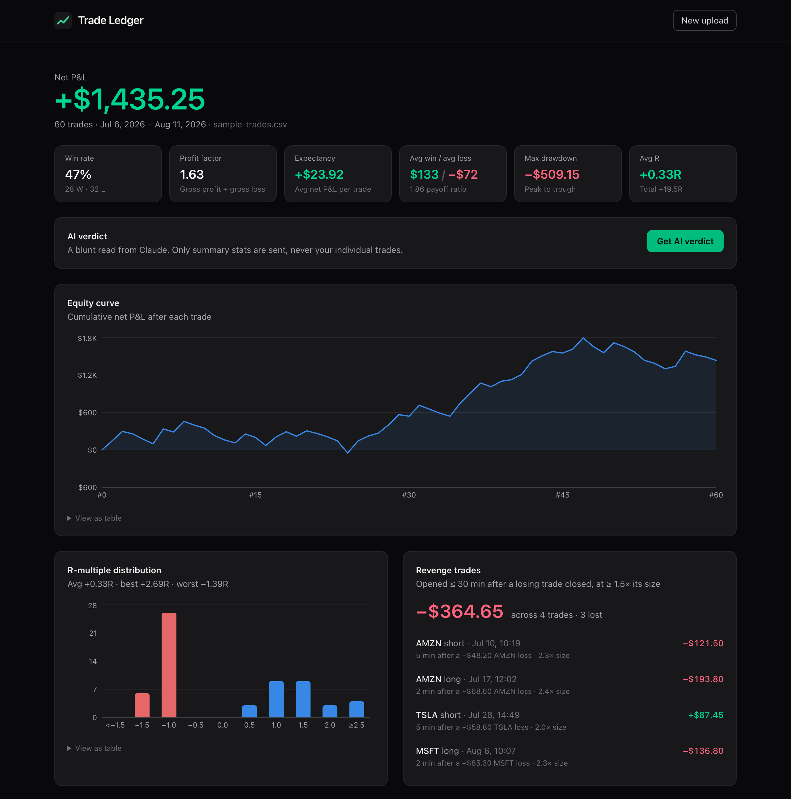

# Trade Ledger

A trading journal that finds the leaks in your trading. Upload a CSV of trades to get core performance metrics,
R-multiples, behavioral patterns, revenge-trade detection, and a blunt AI verdict from Claude.

**Live demo:** [trade-ledger-xi.vercel.app](https://trade-ledger-xi.vercel.app) · no data of your own?
[Open it with 60 sample trades loaded →](https://trade-ledger-xi.vercel.app/?demo)



## Features

- **Upload:** drag-and-drop a CSV, or load the bundled sample (60 trades with a few planted revenge trades).
  Parsing happens in the browser. Bad rows are skipped and listed with their line number and every problem found,
  instead of breaking the upload.
- **Core metrics:** net P&L, win rate, average win and loss with payoff ratio, profit factor, expectancy and
  max drawdown.
- **R-multiples:** each trade's result in units of initial risk, `(exit − entry) / (entry − stop)`, with the sign
  flipped for shorts. Shown as an average and a distribution chart.
- **Behavioral metrics:** P&L by weekday and by hour, how the next trade goes after a win vs. after a loss,
  whether position size (entry × size) grows after losses, and the longest win and loss streaks.
- **Revenge-trade detection:** flags a trade opened within 30 minutes of a losing trade's close at ≥ 1.5× its size,
  then lists the flagged trades and their combined P&L.
- **Equity curve:** cumulative net P&L with a hover readout of each trade and its drawdown from the peak.
- **AI verdict:** Claude reviews the summary stats and returns 3 strengths, 3 leaks and one concrete rule to follow
  next week.

Every chart has a hover tooltip and a "View as table" option, so no number is only visible on hover. The layout works
down to phone width.

## CSV format

| Column      | Required | Notes                                                        |
| ----------- | -------- | ------------------------------------------------------------ |
| `date`      | yes      | ISO datetime the trade opened, e.g. `2026-07-06T09:38:00`   |
| `exit_date` | no       | ISO datetime it closed; revenge detection falls back to `date` |
| `symbol`    | yes      | Ticker                                                        |
| `side`      | yes      | `long` or `short`                                             |
| `entry`     | yes      | Entry price                                                   |
| `exit`      | yes      | Exit price                                                    |
| `stop`      | yes      | Initial stop: below entry for longs, above for shorts         |
| `size`      | yes      | Quantity                                                      |
| `fees`      | no       | Total fees for the trade; subtracted from P&L                 |

```csv
date,exit_date,symbol,side,entry,exit,stop,size,fees
2026-07-06T09:38:00,2026-07-06T09:54:00,SPY,long,628.26,642.93,619,10,1.00
2026-07-08T12:47:00,,MSFT,short,506.66,494.70,511.41,20,
```

## How it's built

- **React 19 + Vite**, styled with **Tailwind CSS v4**. **PapaParse** reads the CSV and **Recharts** draws the charts.
  The chart code is lazy-loaded, so the upload screen ships about 81 KB gzipped.
- **Metrics are pure functions** in [`src/lib/metrics.js`](src/lib/metrics.js), covered by Vitest unit tests
  that use hand-computed fixtures, edge cases, and the patterns planted in the sample data.
- **AI verdict:** a Vercel serverless function at [`api/verdict.js`](api/verdict.js) calls the Anthropic API
  (Claude Opus 5) and asks for a JSON-schema structured output. Its logic lives in
  [`server/verdict.js`](server/verdict.js) and is unit-tested against a fake client.
- **Chart colors** were checked with a colorblind-safety validator. Profit is blue and loss is red, because
  green vs. red collapses for deuteranopes. Bars above or below zero also show the sign.

### Security

- The Anthropic API key is only ever read from the `ANTHROPIC_API_KEY` environment variable, on the server. It is
  never in frontend code or git.
- Claude receives only a ~2 KB summary of computed metrics, never raw trades or CSV text. The server rebuilds that
  summary from a fixed list of allowed fields and checks every type and range. The only text that can reach the
  prompt is weekday names, ISO dates and ticker-shaped symbols, which closes off prompt injection through uploaded data.
- Abuse protection: bodies over 16 KB are rejected while being read, requests are rate-limited per IP (5 per 10 min)
  with a global cap per instance, only `POST` with JSON is accepted, and the function times out at 60 s. Errors from
  the API are turned into friendly messages without passing on upstream details.

### Built with Claude Code

This project was built with [Claude Code](https://claude.com/claude-code), Anthropic's agentic coding tool, working
from the spec in [`CLAUDE.md`](CLAUDE.md). The commit history shows the build step by step: scaffold, parser, sample
data, metrics engine and tests, dashboard, then the AI verdict.

## Documentation

| Doc | What's in it |
| --- | --- |
| [Architecture](docs/architecture.md) | Data flow diagram, module map, and the reasoning behind key design decisions |
| [Metrics reference](docs/metrics.md) | Exact definition, formula and edge cases for every number on the dashboard |
| [CSV format](docs/csv-format.md) | Full input spec and every validation rule and error message |
| [`/api/verdict` reference](docs/api.md) | Request and response schemas, status codes, limits, model settings, security model |
| [Development](docs/development.md) | Setup, scripts, testing, local API route, sample data, deployment |

## Local setup

Requires Node.js 20.19+ or 22.12+.

```bash
git clone https://github.com/TheKhadas/trade-ledger.git
cd trade-ledger
npm install
cp .env.example .env.local   # then add your ANTHROPIC_API_KEY (only needed for the AI verdict)
npm run dev                  # http://localhost:5173 (also serves /api/verdict)
```

| Command         | What it does                         |
| --------------- | ------------------------------------ |
| `npm run dev`   | Dev server, including the API route  |
| `npm test`      | Run the Vitest suite                 |
| `npm run lint`  | Lint with oxlint                     |
| `npm run build` | Production build to `dist/`          |

Everything except the AI verdict works without an API key.

### Deploying

Import the repo into [Vercel](https://vercel.com/new). It detects Vite automatically, and `api/verdict.js` becomes a
serverless function. Add `ANTHROPIC_API_KEY` under Project → Settings → Environment Variables. Setting a monthly spend
limit in the Anthropic Console is a good idea for a public deployment.

## Project structure

```
api/verdict.js          Vercel function: POST /api/verdict
server/verdict.js       Verdict handler: validation, rate limiting, Claude call
src/lib/parseTrades.js  CSV parsing and per-row validation
src/lib/metrics.js      All metric calculations (pure functions)
src/lib/verdictPayload.js  Summary sent to Claude + server-side validator
src/components/         Upload screen, dashboard, charts
public/sample-trades.csv  Sample data
```
