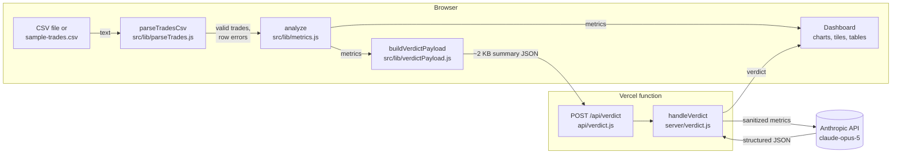

# Architecture

Trade Ledger is a static single-page app plus one serverless function. Everything except the AI verdict runs in
the browser: the uploaded CSV never leaves the visitor's machine.

## Data flow

1. **Parse.** The CSV is read in the browser (`File.text()` or `fetch` for the sample), parsed with PapaParse, and each
   row is validated. Invalid rows are skipped and reported with their line numbers; valid trades are sorted by open time.
2. **Analyze.** `analyze(trades)` runs every metric in one pass and returns a plain object. It is memoized in
   `App.jsx`, so charts re-render without recomputing.
3. **Render.** The dashboard is a pure function of that object.
4. **Verdict (on demand).** When the visitor clicks **Get AI verdict**, the browser condenses the metrics into a
   summary and POSTs it to `/api/verdict`. The function re-validates the summary, calls Claude, validates Claude's
   answer, and returns it.

## Module map

| Path | Responsibility |
| --- | --- |
| `src/lib/parseTrades.js` | CSV parsing, header normalization, per-row validation, sorting. See [csv-format.md](csv-format.md). |
| `src/lib/metrics.js` | Every metric as a pure function over validated trades. See [metrics.md](metrics.md). |
| `src/lib/verdictPayload.js` | `buildVerdictPayload` (client) and `sanitizeVerdictPayload` (server): the only data Claude sees. |
| `src/lib/format.js` | Number, money, percent, R and date formatting; typographic minus signs. |
| `src/App.jsx` | Top-level state: upload → parse → analyze; `?demo` auto-load; lazy-loads the dashboard. |
| `src/components/UploadPanel.jsx` | Drag-and-drop / file picker, file type and size checks, **Load sample data**. |
| `src/components/RowErrors.jsx` | Collapsible list of skipped rows and why. |
| `src/components/TradesTable.jsx` | All trades with net P&L, R and revenge badges. |
| `src/components/ChartCard.jsx` | Card wrapper that pairs every chart with a "View as table" twin. |
| `src/components/charts/` | `EquityChart`, `SignedBarChart` (weekday, hour, R histogram), tooltip, color tokens. |
| `src/components/dashboard/` | `Dashboard` layout, `StatTile`, `RevengeCard`, `BehaviorCard`, `VerdictCard`. |
| `server/verdict.js` | Verdict handler: request checks, rate limiting, prompt, Claude call, response validation. |
| `api/verdict.js` | Vercel entry point: reads `ANTHROPIC_API_KEY`, creates the SDK client, exports `POST`. |
| `vite.config.js` | Tailwind + React plugins, and a dev-only middleware that serves `/api/verdict` locally. |
| `vercel.json` | Caps the verdict function at 60 s. |
| `public/sample-trades.csv` | 60 demo trades with planted behavioral patterns. |

## Design decisions

**Client-side analysis.** Parsing and metrics run in the browser, so there is no upload endpoint, no storage, and no
privacy question about trade data. It also keeps the app free to host: only the verdict costs anything.

**Pure metric functions.** `metrics.js` has no React, DOM or formatting code. Each function takes trades and returns
numbers, which keeps them trivially unit-testable and reusable by both the dashboard and the verdict payload.

**The server trusts nothing from the browser.** `sanitizeVerdictPayload` rebuilds the summary field by field from an
allowlist with type and range checks. Unknown keys are dropped; the only strings that survive are weekday names, ISO
dates and ticker-shaped symbols. A hand-crafted request therefore can't inject instructions into the prompt.

**Handler separate from platform glue.** `server/verdict.js` takes a standard `Request` and injected dependencies
(`getClient`, `rateLimit`, `log`) and returns a `Response`. The same handler runs on Vercel (`api/verdict.js`), in local
dev (Vite middleware), and in tests (fake client), with no mocking of modules or the network.

**Structured output instead of prompt-parsed prose.** Claude is asked for a JSON-schema-constrained object (headline,
strengths, leaks, rule), which the server still validates before returning. The UI never renders model text as HTML.

**Lazy-loaded charts.** Recharts is most of the bundle. The dashboard is a `React.lazy` chunk that starts downloading
the moment a file is chosen, so the upload screen loads at about 81 KB gzipped.

**Accessible charts.** Chart colors were validated for colorblind separation: profit is blue and loss is red because
green vs. red fails for deuteranopia. Sign is also encoded by position (above or below the zero baseline). Every chart
has a data table, text never takes a series color, and the verdict's loading status is announced to screen readers.

**Two notions of size.** Revenge detection compares share counts, as specified. Position-size change after wins and
losses compares notional value (entry × size), because share counts can't be compared across symbols with different
prices.
